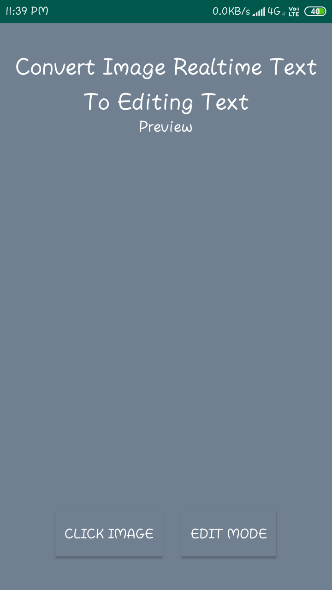
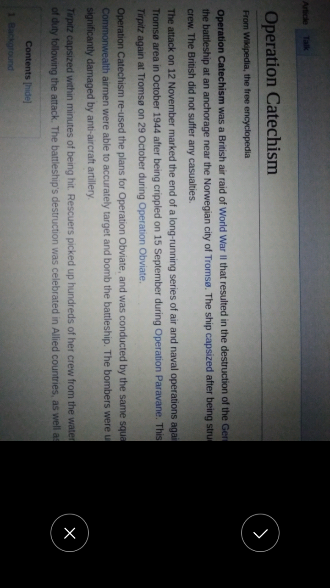
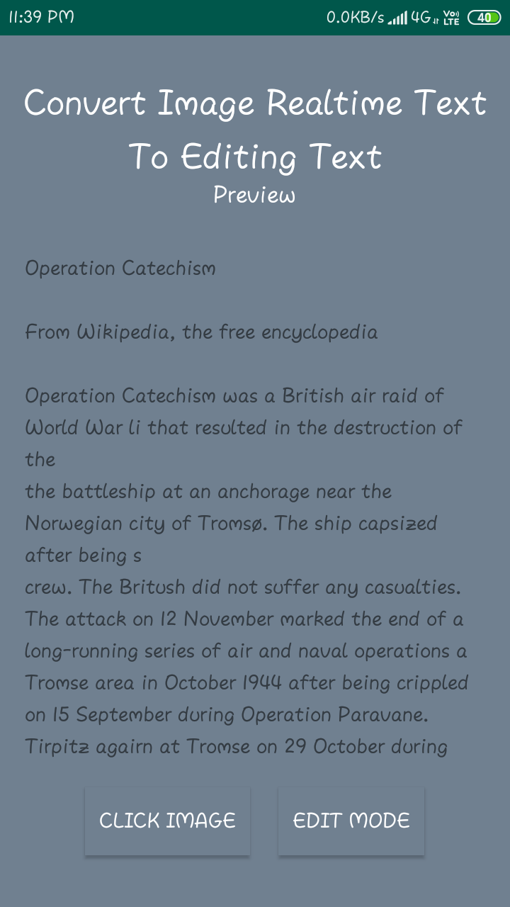
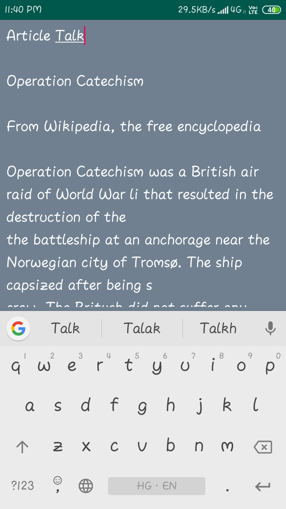

# Image-To-EditableText

## An Android Application useful For identifying text in Images

### Here Is a Simple Demo ScreenShot

 <table>
      <tr>
       <td></td>
       <td></td>
      </tr>
  </table>
  
  
<table>
    <tr>
      <td></td>
       <td></td>
    </tr>
</table>
